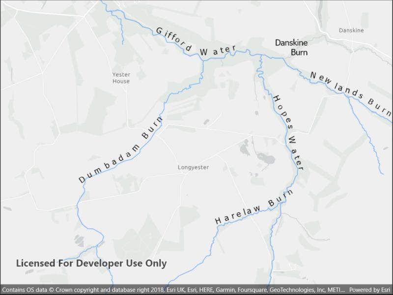

# Display annotation

Display annotation from a feature service URL.

## Use case

Annotation is useful for displaying text that you don't want to move or resize when the map is panned or zoomed (unlike labels which will move and resize). You can use annotation to place text at a fixed size, position, orientation, font, and so on. You may choose to do this for cartographic reasons or because the exact placement of the text is important.

## How to use the sample

Pan and zoom to see names of waters and burns in a small region of Scotland.

## How it works

1. Create a `Map` with a light gray canvas and a viewpoint near the data.
2. Create an `AnnotationLayer` from a feature service URL.
3. Add both layers to the operational layers of the map and add it to a `MapView`.

## Relevant API

* AnnotationLayer
* FeatureLayer

## About the data

Data derived from the [OS Open Rivers](https://www.ordnancesurvey.co.uk/business-government/products/open-map-rivers) dataset from *Ordnance Survey* . Contains OS data &copy; Crown copyright and database right 2018.

The annotation layer contains two sublayers of rivers in East Lothian, Scotland, which were set by the author to only be visible within the following scale ranges:

* Water (1:50,000 - 1:100,000) - A large stream, as defined in the Scots language
* Burn (1:25,000 - 1:75,000) - A brook or small stream, as defined in the Scots language

## Additional information

Annotation is only supported from feature services hosted on [ArcGIS Enterprise](https://enterprise.arcgis.com/en/).

## Tags

annotation, cartography, labels, placement, reference scale, text, utility
