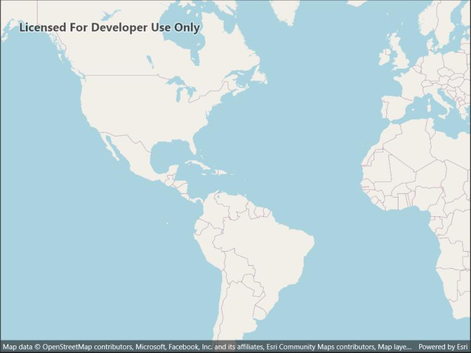

# OpenStreetMap layer

Add OpenStreetMap as a basemap layer.

## Use case

[OpenStreetMap](https://www.openstreetmap.org) is a free community-edited basemap.

## How to use the sample

When the sample opens, it will automatically display the map with the OpenStreetMap basemap. Pan and zoom to observe the basemap.

## How it works

1. Create a basemap wwith a `BasemapStyle.OSMStandard` basemap style.
2. Create a map with that basemap.
3. Show the map in a map view.

## Relevant API

* Basemap
* BasemapStyle.OSMStandard
* Map
* MapView
* OpenStreetMapLayer

## Additional information

OpenStreetMap (OSM) basemaps are in mature support and will no longer be updated. They will be removed in a future version of the ArcGIS Native Maps SDKs. For more information, see the Overture Maps Data in ArcGIS blog. We recommend that you replace your OSM with the equivalent Open Basemap styles.

## Tags

basemap, layers, map, open, OpenStreetMap, OSM, street
