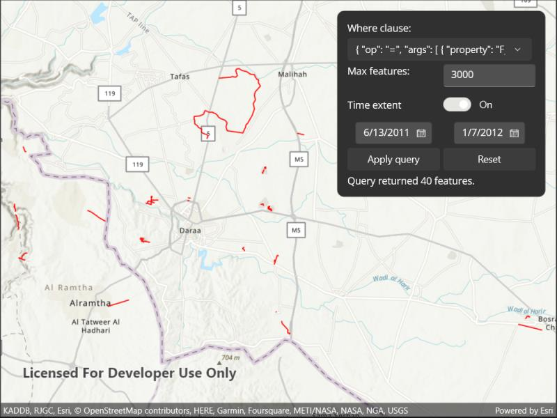

# Query with CQL filters

Query data from an OGC API feature service using CQL filters.

## Use case

CQL (Common Query Language) is an OGC-created query language used to query for subsets of features. Use CQL filters to narrow geometry results from an OGC feature table.

## How to use the sample

Enter a CQL query. Press the "Apply query" button to see the query applied to the OGC API features shown on the map.

## How it works

1. Create an `OgcFeatureCollectionTable` object using a URL to an OGC API feature service and a collection ID.
2. Create a `QueryParameters` object.
3. Set the `QueryParameters.WhereClause` property.
4. Set the `QueryParameters.MaxFeatures` property.
5. Create `Datetime` objects for the start time and end time being queried.
6. Create a `TimeExtent` object using the start and end `Datetime` objects. Set the `QueryParameters.TimeExtent` property
7. Populate the `OgcFeatureCollectionTable` using `PopulateFromServiceAsync()` with the custom `QueryParameters` created in the previous steps.
8. Use `MapView.SetViewpointGeometryAsync()` with the `OgcFeatureCollectionTable.Extent` to view the newly-queried features.

## Relevant API

* OgcFeatureCollectionTable
* QueryParameters
* TimeExtent

## About the data

The [Daraa, Syria test data](https://demo.ldproxy.net/daraa) is OpenStreetMap data converted to the Topographic Data Store schema of NGA.

## Additional information

See the [OGC API website](https://ogcapi.ogc.org/) for more information on the OGC API family of standards. See the [CQL documentation](https://portal.ogc.org/files/96288#cql-core) to learn more about the common query language.

## Tags

browse, catalog, common query language, CQL, feature table, filter, OGC, OGC API, query, service, web
