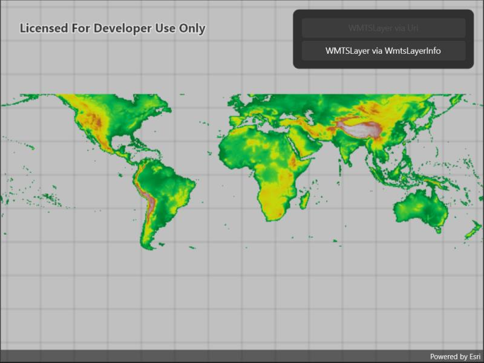

# WMTS layer

Display a layer from a Web Map Tile Service.

## Use case

WMTS services can have several layers. You can use Runtime to explore the layers available from a service. This would commonly be used to enable a browsing experience where users can choose which layers they want to display at run time.

## How to use the sample

The layer will be displayed automatically. Use the buttons to choose a different method of loading the layer.

## How it works

To display a WMTS layer directly from a URL:

1. Create a `WmtsService` object using the URL of the WMTS service.
2. Create a `WmtsLayer` object with the ID of the layer to display.

To explore layers from a WMTS service:

1. Create a `WmtsService` object using the URL of the WMTS service.
2. After loading the WMTS service, get the list of `WmtsLayerInfo` objects from the service info of the WMTS service.
3. Use one of the layer infos to create the WMTS layer.
4. Create a basemap with the WMTS layer and set it to the map.

## Relevant API

* WmtsLayer
* WmtsLayerInfo
* WmtsService
* WmtsServiceInfo

## About the data

We acknowledge the use of imagery provided by services from the [Global Imagery Browse Services (GIBS)](https://www.earthdata.nasa.gov/eosdis/science-system-description/eosdis-components/gibs), operated by the [NASA/GSFC/Earth Science Data and Information System (ESDIS)](https://earthdata.nasa.gov) with funding provided by NASA/HQ.

## Tags

layer, OGC, raster, tiled, web map tile service
