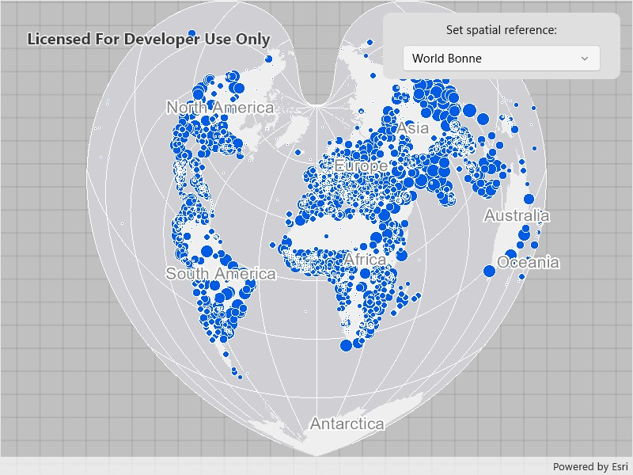

# Set spatial reference

Specify a map's spatial reference.

## Use case

Choosing the correct spatial reference is important for ensuring accurate projection of data points to a map.  

## How to use the sample

Pan and zoom around the map. Observe how the map is displayed in the World Bonne spatial reference. Pick a different spatial reference and see the map reproject.

## How it works

1. Instantiate a `Map` object using a spatial reference.
2. Instantiate a `Basemap` object using an `ArcGISMapImageLayer` object.
3. Set the basemap to the map.
4. Set the map to a `MapView` object.
5. Change the map's spatial reference using `setSpatialReference` method.

The ArcGIS map image layer will reproject into the spatial reference set to the map (such as World Bonne (WKID: 54024)), and not the map service's default spatial reference.

## Relevant API

* ArcGISMapImageLayer
* Basemap
* Map
* MapView
* SpatialReference

## About the data

This sample uses a [World Cities Population](https://sampleserver6.arcgisonline.com/arcgis/rest/services/SampleWorldCities/MapServer) map service that displays world cities symbolized based on population.

## Additional information

Operational layers will automatically project to this spatial reference when possible. There are 3 kinds of layer reprojection behaviors:

- Reprojected on device (on-the-fly reprojection), such as a `FeatureLayer` created from a mobile geodatabase
- Reprojected from the service, such as an `ArcGISMapImageLayer`
- Not able to reproject, such as an `ArcGISTiledLayer` with defined spatial reference in its tile cache. These layer might be able to reproject in a future update

For more information, check out the API reference doc for `setSpatialReference` method.

## Tags

coordinate system, project, projection, spatial reference, Web Mercator, WGS84, WKID
