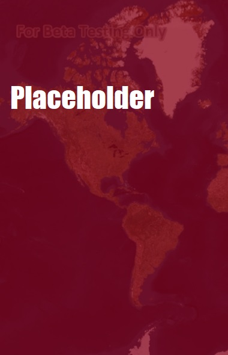

# Apply point cloud renderer and filter

Visualize point cloud data using different renderers and filters.

## Use case

Point clouds contain large collections of 3D points captured by sensors such as lidar. Each point can include attributes that describe its color, elevation, classification, return, and other properties. Applying renderers and filters to these attributes can reveal patterns in the data and isolate points of interest, such as buildings or vegetation.

## How to use the sample

The sample initially displays a point cloud layer using its RGB values. Select a renderer to visualize the points by RGB color, elevation, or LAS classification code.

Use the point size control to increase or decrease the size of the rendered points. Point size is a property of the renderer's splat algorithm.

Use the filter controls to show points that match selected classification codes, lidar return types, and scan direction flag values. Multiple filters can be applied at the same time. Clear an individual filter to remove it from the point cloud layer.

## How it works

1. Create a `PointCloudLayer` with the Sonoma Area 1 point cloud scene layer URL and add it to a scene's operational layers.
2. Create the following point cloud renderers:
   * Create a `PointCloudRGBRenderer` using the `RGB` attribute.
   * Create a `PointCloudStretchRenderer` using the `ELEVATION` attribute and three `PointCloudColorStop` objects distributed across the elevation range.
   * Create a `PointCloudClassBreaksRenderer` using the `ELEVATION` attribute and three `PointCloudColorClassBreak` objects distributed across the elevation range.
   * Create a `PointCloudUniqueValueRenderer` using the `CLASS_CODE` attribute and `PointCloudColorUniqueValue` objects for classification values 1 through 18.
3. Set a `PointCloudSplatAlgorithm` on each renderer and set its `PointsPerInch` property to `25`.
4. Set the selected renderer on the point cloud layer's `Renderer` property. The `PointCloudRGBRenderer` we constructed is applied initially.
5. Create the following point cloud filters:
   * Create a `PointCloudValueFilter` using the `CLASS_CODE` attribute and the selected classification values and the selected include or exclude mode.
   * Create a `PointCloudReturnFilter` using the `RETURNS` attribute and the selected return types.
   * Create a `PointCloudBitfieldFilter` using the `FLAGS` attribute and the selected required set and clear values for scan direction flag bit 6.
6. Add, update, or remove each filter independently in the point cloud layer's `Filters` collection as its selections change. The collection is initially empty.

## Relevant API

* PointCloudBitfieldFilter
* PointCloudClassBreaksRenderer
* PointCloudColorClassBreak
* PointCloudColorStop
* PointCloudColorUniqueValue
* PointCloudLayer
* PointCloudReturnFilter
* PointCloudRGBRenderer
* PointCloudSplatAlgorithm
* PointCloudStretchRenderer
* PointCloudUniqueValueRenderer
* PointCloudValueFilter

## About the data

This sample uses the [Sonoma Area 1 LiDAR RGB point cloud scene layer](https://www.arcgis.com/home/item.html?id=bc963a0adfd7450d8cc11b58510fda8d#overview). The layer provides the `RGB`, `ELEVATION`, `CLASS_CODE`, `RETURNS`, and `FLAGS` attributes used by the renderers and filters.

## Tags

3D, classification, filter, lidar, point cloud, renderer, scene layer, visualization
