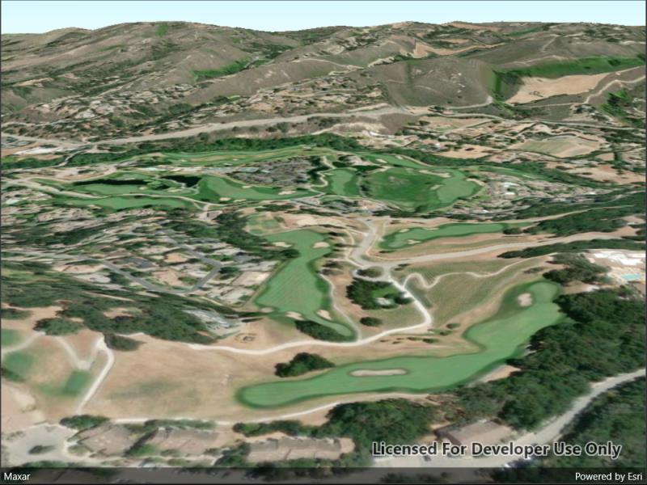

# Create terrain surface from a local raster

Set the terrain surface with elevation described by a raster file.

## Use case

In a scene view, the terrain surface is what the basemap, operational layers, and graphics are draped onto. For example, when viewing a scene in a mountainous region, applying a terrain surface to the scene will help in recognizing the slopes, valleys, and elevated areas.

## How to use the sample

When loaded, the sample will show a scene with a terrain surface applied. Pan and zoom to explore the scene and observe how the terrain surface allows visualizing elevation differences.

## How it works

1. Create a `Scene` and add it to a `SceneView`.
2. Create a `RasterElevationSource` with a list of raster file paths.
3. Add this source to the scene's base surface: `Scene.BaseSurface.ElevationSources.Add(rasterElevationSource)`.

## Relevant API

* RasterElevationSource
* Surface

## Additional information

Supported raster formats include:

* ASRP/USRP
* CIB1, 5, 10
* DTED0, 1, 2
* GeoTIFF
* HFA
* HRE
* IMG
* JPEG
* JPEG 2000
* NITF
* PNG
* RPF
* SRTM1, 2

## Tags

3D, elevation, raster, surface, terrain