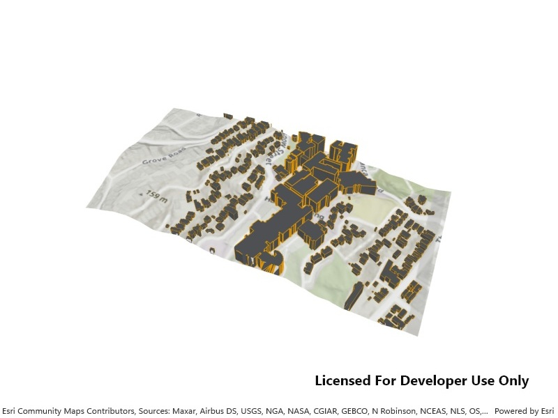

# Display local scene

Display a local scene with a topographic surface and 3D scene layer clipped to a local area.

## Use case

A `LocalSceneView` is a user interface that displays 3D basemaps and layer content described in a `Scene` with a local `SceneViewingMode`.

Unlike a global scene which is drawn on a globe using a geographic coordinate system, a local scene is drawn on a flat surface and supports projected coordinate systems. They are generally used to view local data and are often clipped to a specific area of interest. Currently, `LocalSceneView` cannot display data provided by a global scene and `SceneView` cannot display data provided by a local scene.

The `LocalSceneView` displays the clipped area of the local scene, supports user interactions such as pan and zoom, and provides access to the underlying scene data.

## How to use the sample

This sample displays a local scene clipped to an extent. Pan and zoom to explore the scene.

## How it works

1. Create a local scene object with the `Scene(BasemapStyle, SceneViewingMode)` constructor and 'Local' viewing mode.
2. Create an `ArcGISTiledElevationSource` object and add it to the local scene's base surface.
3. Create an `ArcGISSceneLayer` and add it to the local scene's operational layers.
4. Create an `Envelope` and set it to the `scene.ClippingArea`, then enable clipping by setting `scene.IsClippingEnabled` to `true`.
5. Create a `LocalSceneView` object to display the scene.
6. Set the initial viewpoint for the local scene.
7. Set the local scene to the local scene view.

## About the data

The [scene layer](https://www.arcgis.com/home/item.html?id=7a63e9808a054d39964a8b4712c85657) in this sample shows 3D extruded rooftop outlines of buildings on the Victoria University campus and surrounding vicinity in Wellington, New Zealand.

## Relevant API

* ArcGISSceneLayer
* ArcGISTiledElevationSource
* LocalSceneView
* Scene

## Tags

3D, basemap, elevation, scene, surface
