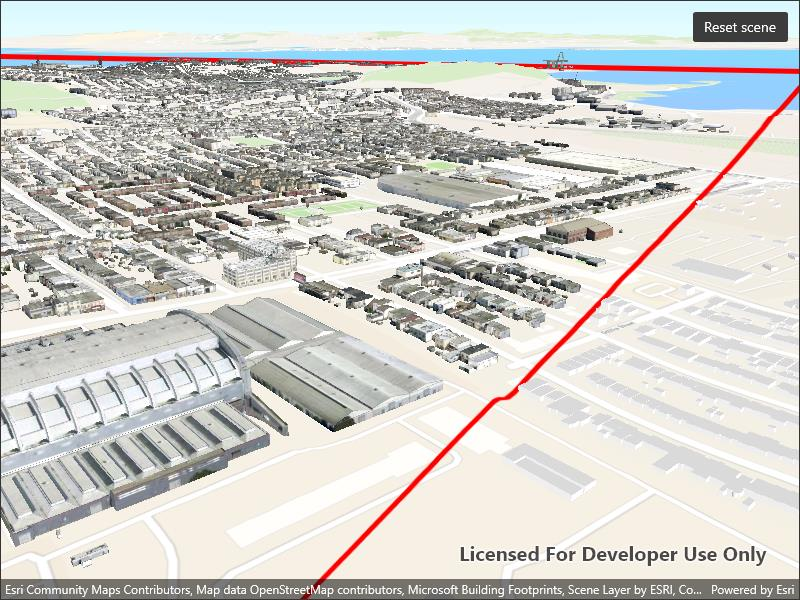

# Filter features in scene

Filter 3D scene features out of a given geometry with a polygon filter.

## Use case

You can directly control what users see within a specific scene view to give a more focused or cleaner user experience by using a `SceneLayerPolygonFilter` to selectively show or hide scene features within a given area.

## How to use the sample

The sample initializes showing the "Navigation" 3D Basemap. Tap the "Filter 3D buildings in extent" button, to set a `SceneLayerPolygonFilter` and filter out the Esri 3D buildings within the extent of a detailed buildings scene layer. Notice how the Esri 3D buildings within and intersecting the extent of the detailed buildings layer are hidden. Tap the "Show detailed buildings" button to load a scene layer that contains more detailed buildings. Tap the "Reset scene" button to hide the detailed buildings scene layer and clear the 3D buildings filter.

## How it works

1. Create a `Surface` for the scene and set the World Elevation 3D as an elevation source.
2. Construct a `Basemap` for the scene using the "Navigation" 3D Basemap, load it, then search for the "buildings" baselayer.
3. Add the 3D San Francisco Buildings `ArcGISSceneLayer` to the scene's operational layers and set its visibility to `false` so it does not intersect the 3D basemap buildings.
4. Construct a `SceneLayerPolygonFilter` with the extent of the San Francisco Buildings Scene Layer and the `SceneLayerPolygonFilterSpatialRelationship.Disjoint` enum to hide all features within the extent.
5. Set the `SceneLayerPolygonFilter` on the 3D buildings layer to hide all 3D buildings within the extent of the San Francisco Buildings layer.
6. Set the visibility of the 3D San Francisco Buildings layer to `true` to show the 3D buildings in the extent.

## Relevant API

* ArcGISSceneLayer
* SceneLayerPolygonFilter
* SceneLayerPolygonFilterSpatialRelationship

## About the data

This sample uses the [Navigation 3D Basemap](https://www.arcgis.com/home/item.html?id=00a5f468dda941d7bf0b51c144aae3f0), which includes commercial 3D buildings data acquired from TomTom and Vantor, in addition to Esri Community Maps and Overture Maps Foundation data. It also uses the [San Francisco 3D Buildings](https://www.arcgis.com/home/item.html?id=d3344ba99c3f4efaa909ccfbcc052ed5) scene layer, which provides detailed 3D models of buildings in San Francisco, California, USA.

## Additional information

This sample uses `SceneLayerPolygonFilterSpatialRelationship.Disjoint` to hide all features within the extent of the given geometry. You can alternatively use the `SceneLayerPolygonFilterSpatialRelationship.Contains` enum to only show features within the extent of the geometry.

You can also show or hide features in a scene layer using `ArcGISSceneLayer.SetFeatureVisible()` or `SetFeaturesVisible()` and pass in a feature or list of features and a boolean value to set their visibility.

## Tags

3D, buildings, disjoint, exclude, extent, filter, hide, polygon