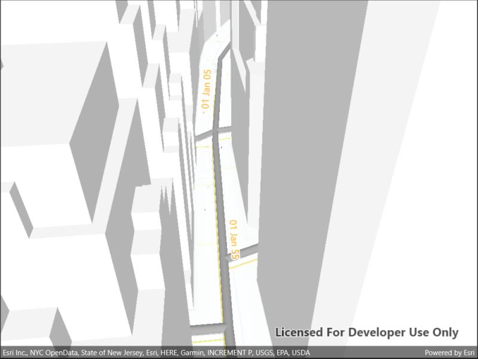

# Show labels on layer 3D

Display custom labels in a 3D scene.

## Use case

Labeling features is useful to visually display information or attributes on a scene. For example, city officials or maintenance crews may want to show installation dates of features of a gas network.

## How to use the sample

Pan and zoom to explore the scene. Notice the labels showing installation dates of features in the 3D gas network.

## How it works

To open a web scene from a portal item:

1. Create a `Scene` from a URL, then load.
2. After loading is complete, obtain the gas layer from the scene's operational layers.
3. From the gas layer, find the main gas sublayer.
4. Create a `TextSymbol` to use for displaying the label text.
5. Create a `LabelDefinition` using an `ArcadeLabelExpression`.
6. Add the definition to the feature layer's `labelDefinitions` list.

## Relevant API

* ArcadeLabelExpression
* LabelDefinition
* Scene
* SceneView

## About the data

This sample shows a [New York City infrastructure](https://www.arcgis.com/home/item.html?id=850dfee7d30f4d9da0ebca34a533c169) scene hosted on ArcGIS Online.

## Tags

3D, labeling, scene, web scene
