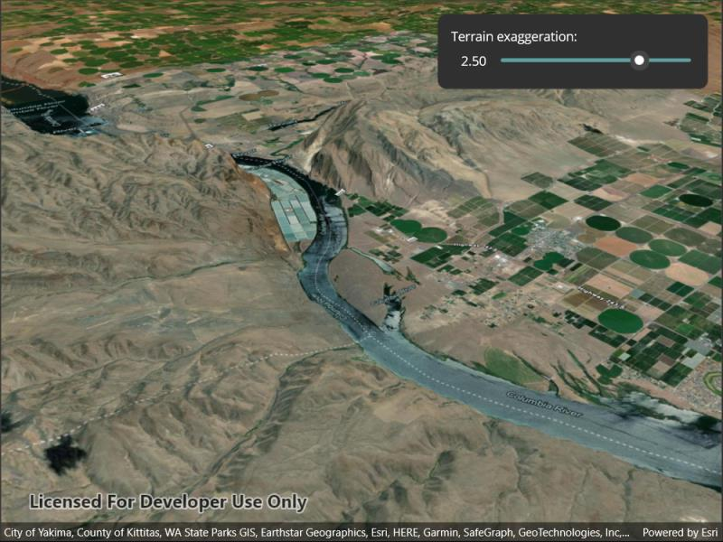

# Terrain exaggeration

Vertically exaggerate terrain in a scene.

## Use case

Vertical exaggeration can be used to emphasize subtle changes in a surface. This can be useful in creating visualizations of terrain where the horizontal extent of the surface is significantly greater than the amount of vertical change in the surface. A fractional vertical exaggeration can be used to flatten surfaces or features that have extreme vertical variation.

## How to use the sample

Use the slider to update terrain exaggeration.

## How it works

1. Create an elevation source and add it to a new surface.
    * An elevation source defines the terrain based on a digital elevation model (DEM) or digital terrain model (DTM).
2. Add the surface.
    * The surface visualizes the elevation source.
3. Configure the surface's elevation exaggeration using `Surface.ElevationExaggeration`.

## Relevant API

* Scene
* Scene.BaseSurface
* Surface
* Surface.ElevationExaggeration

## Tags

3D, DEM, DTM, elevation, scene, surface, terrain
