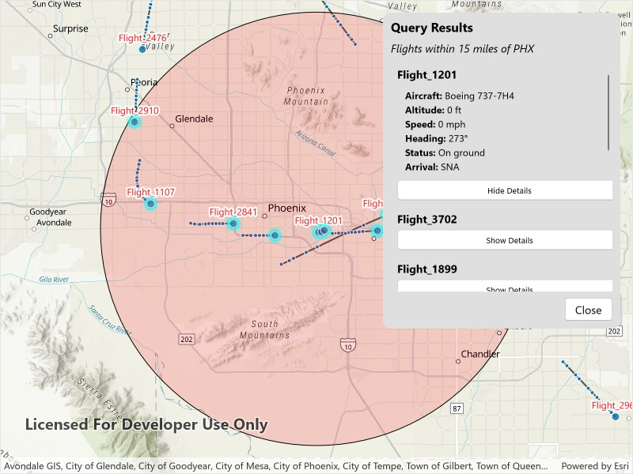

# Query dynamic entities

Find dynamic entities from a data source that match a query.

## Use case

Developers can query a `DynamicEntityDataSource` to find dynamic entities that meet spatial and/or attribute criteria. The query returns a collection of dynamic entities matching the `DynamicEntityQueryParameters` or Track IDs at the moment the query is executed. An example of this is a flight tracking app that monitors airspace near a particular airport, allowing the user to monitor flights based on different criteria such as arrival airport or flight number.

## How to use the sample

Tap the "Query Flights" button and select a query to perform from the menu. Once the query is complete, a list of the resulting flights will be displayed. Tap on a flight to see its latest attributes in real-time.

## How it works

1. Create a `DynamicEntityDataSource` to stream dynamic entity events.
2. Create a `DynamicEntityLayer` using the data source and add it to the map's operational layers.
3. Create `DynamicEntityQueryParameters` and set its properties to specify the parameters for the query:
    1. To spatially filter results, set the `geometry` and `spatialRelationship`. The spatial relationship is `intersects` by default.
    2. To query entities with certain attribute values, set the `whereClause`.
    3. To get entities with specific track IDs, modify the `trackIDs` collection.
4. To perform a dynamic entities query, use `DynamicEntityDataSource.QueryDynamicEntitiesAsync()` to query with multiple criteria (such as track IDs, spatial, and/or attribute filters), or use `DynamicEntityDataSource.QueryDynamicEntitiesAsync(trackIDs)` if you want to query *only* by track IDs.
5. When complete, iterate through the returned collection of `DynamicEntity` objects from the result.
6. Use the `DynamicEntity.DynamicEntityChanged` event to get real-time updates when entity attributes change.
7. Get the new observation from the resulting `DynamicEntityChangedEventArgs` using the `ReceivedObservation` property to update the UI with current information.

## Relevant API

* DynamicEntity
* DynamicEntityChangedInfo
* DynamicEntityDataSource
* DynamicEntityDataSourceInfo
* DynamicEntityLayer
* DynamicEntityObservation
* DynamicEntityQueryParameters
* DynamicEntityQueryResult

## About the data

This sample uses the [PHX Air Traffic JSON](https://www.arcgis.com/home/item.html?id=c78e297e99ad4572a48cdcd0b54bed30) portal item, which is hosted on ArcGIS Online and downloaded automatically. The file contains JSON data for mock air traffic around the Phoenix Sky Harbor International Airport in Phoenix, AZ, USA. The decoded data is used to simulate dynamic entity events through a `CustomDynamicEntityDataSource`, which is displayed on the map with a `DynamicEntityLayer`.

## Additional information

A dynamic entities query is performed on the most recent observation of each dynamic entity in the data source at the time the query is executed. As the dynamic entities change, they may no longer match the query parameters.

## Tags

data, dynamic, entity, live, query, real-time, search, stream, track
