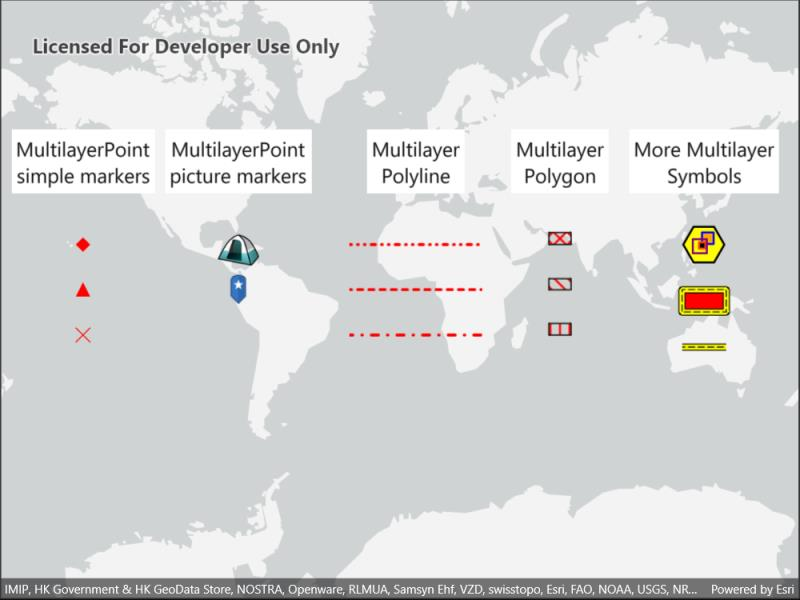

# Render multilayer symbols

Show different kinds of multilayer symbols on a map similar to some pre-defined 2D simple symbol styles.

## Use case

Allows you to customize a graphic with a multilayer symbol. For example, you may want more customizable symbols than the one that is provided with the API to display a unique representation of a landmark.

## How to use the sample

The sample loads multilayer symbols for points, polylines, and polygons.

## How it works

1. Create multilayer symbols for each predefined 2D simple symbol style.
    * For multilayer point symbols, use the `MultilayerPoint` constructor.
    * For multilayer polyline symbols, use the `MultiLayerPolyline` constructor.
    * For multilayer polygon symbols, use the `MultiLayerPolygon` constructor.
2. Create graphics by passing in a geometry and the associated symbol.
3. Add graphics to the graphics overlay with `graphicsOverlay.Graphics.Add(graphic)`

## Relevant API

* Graphic
* GraphicsOverlay
* MultiLayerPoint
* MultiLayerPolygon
* MultiLayerPolyline
* PictureMarkerSymbolLayer
* SolidFillSymbolLayer
* SolidStrokeSymbolLayer
* VectorMarkerSymbolLayer

## Tags

graphic, marker, multilayer, picture, symbol
