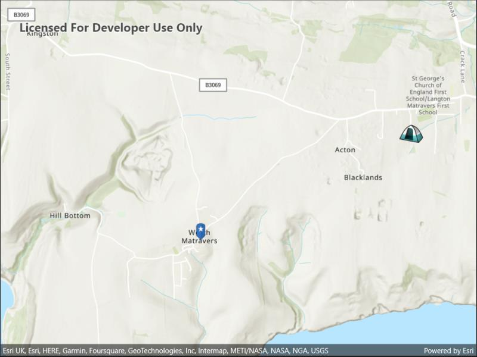

# Picture marker symbol

Use pictures for markers.

## Use case

When marking geoelements on a map, using custom, unique symbols can be helpful for highlighting and differentiating between locations. For example, a tourism office may use pictures of landmarks as symbols on an online map or app, to help prospective visitors to orient themselves more easily around a city.

## How to use the sample

When launched, this sample displays a map with picture marker symbols. Pan and zoom to explore the map.

## How it works

1. Create a `PictureMarkerSymbol` using the URI to an online or local image or a JavaFX Image (platform dependent).
2. Create a `Graphic` and set its symbol to the picture marker symbol.

## Relevant API

* PictureMarkerSymbol

## About the data

The picture marker symbols in this sample are all constructed from different types of resources:

* [Campsite symbol constructed from a URL](https://static.arcgis.com/images/Symbols/OutdoorRecreation/Camping.png)
* Blue pin with a star stored in the resource folder that comes with the application

## Tags

graphics, marker, picture, symbol, visualization
