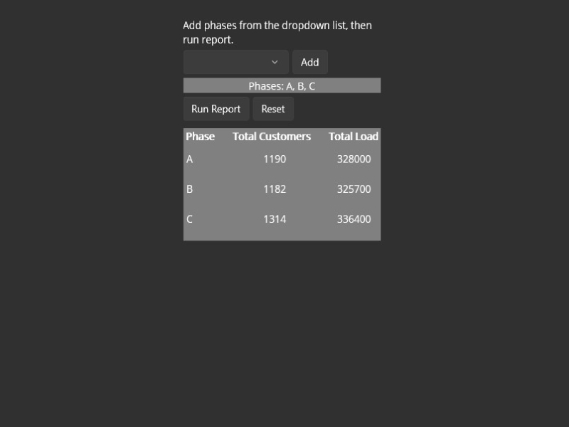

# Create load report

Demonstrates the creation of a simple electric distribution report. It traces downstream from a given point and adds up the count of customers and total load per phase.

## Use case

You can use a load report to display the customers per phase as well as the load per phase based on a chosen starting point in a utility network. Load reports are used for electric load restoration and balancing.

## How to use the sample

Choose phases to be included in the report. Tap 'Run Report' to initiate a downstream trace on the network and create a load report. Tap 'Reset' to clear the phases and start over.

## How it works

1. Create and load a `UtilityNetwork` with a feature service URL, then get an asset type, tier, network attributes, and category by their names.
2. Create a `UtilityElement` from the asset type to use as the starting location for the trace.
3. Get a base condition from the `UtilityTier.TraceConfiguration.Traversability.Barriers`.
4. Create `UtilityTraceParameters` passing in `UtilityTraceType.downstream` and the default starting location. Set its `UtilityTraceConfiguration` with the `UtilityTier.traceConfiguration`.
5. Create a `UtilityCategoryComparison` where `"Service Point"` category exists.
6. Reset `UtilityTraceConfiguration.functions` with a new `UtilityTraceFunction` adding a `Service Load` network attribute where this category comparison applies. This will limit the function results.
7. Set `UtilityTraceConfiguration.outputCondition` with this category comparison to limit the element results.
8. Populate the choice list for `Phases` using the network attribute's `CodedValueDomain.codedValues`.
9. When the "Add Phase" button is clicked, add the selected `CodedValue.name` to a phases list.
10. When the "Run Report" button is clicked, run a trace for every `CodedValue` in the phases list. Do this by creating a `UtilityTraceOrCondition` with the base condition and a `UtilityNetworkAttributeComparison` where the "Phases Current" network attribute does not include the `CodedValue.code` value.
11. Display the count of "Total Customers" using `UtilityElementTraceResult.elements` and the result of "Total Load", the first and only `UtilityFunctionTraceResult.functionOutputs`.

## Relevant API

* UtilityAssetType
* UtilityCategoryComparison
* UtilityDomainNetwork
* UtilityElement
* UtilityElementTraceResult
* UtilityNetwork
* UtilityNetworkAttribute
* UtilityNetworkAttributeComparison
* UtilityNetworkDefinition
* UtilityNetworkSource
* UtilityTerminal
* UtilityTier
* UtilityTraceConfiguration
* UtilityTraceFunction
* UtilityTraceParameters
* UtilityTraceResult
* UtilityTraceType
* UtilityTraversability

## About the data

The [Naperville electrical](https://sampleserver7.arcgisonline.com/server/rest/services/UtilityNetwork/NapervilleElectric/FeatureServer) network feature service, hosted on ArcGIS Online, contains a utility network used to run the subnetwork-based trace shown in this sample.

## Additional information

Using utility network on ArcGIS Enterprise 10.8 requires an ArcGIS Enterprise member account licensed with the [Utility Network user type extension](https://enterprise.arcgis.com/en/portal/latest/administer/windows/license-user-type-extensions.htm#ESRI_SECTION1_41D78AD9691B42E0A8C227C113C0C0BF). Please refer to the [utility network services documentation](https://enterprise.arcgis.com/en/server/latest/publish-services/windows/utility-network-services.htm).

## Tags

condition barriers, downstream trace, network analysis, subnetwork trace, trace configuration, traversability, upstream trace, utility network, validate consistency
