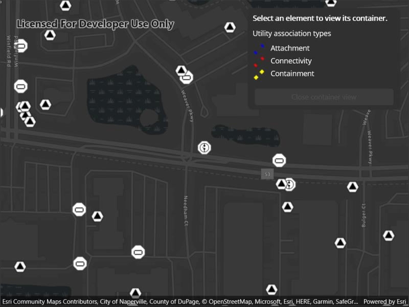

# Display content of utility network container

A utility network container allows a dense collection of features to be represented by a single feature, which can be used to reduce map clutter.

## Use case

Offering a container view for features aids in the review for valid structural attachment and containment relationships and helps determine if a dataset has an association role set. Container views often model a cluster of electrical devices on a pole top or inside a cabinet or vault.

## How to use the sample

Tap on a container feature to show all features inside the container. The container is shown as a polygon graphic with the content features contained within. The viewpoint and scale of the map are also changed to the container's extent. Connectivity and attachment associations inside the container are shown as red and blue dotted lines respectively.

## How it works

1. Create and load a web map that includes ArcGIS Pro [Subtype Group Layers](https://pro.arcgis.com/en/pro-app/help/mapping/layer-properties/subtype-layers.htm) with only container features visible (i.e. fuse bank, switch bank, transformer bank, hand hole and junction box).
2. Get and load the first `UtilityNetwork` from the web map.
3. Add a `GraphicsOverlay` for displaying a container view.
4. Add an event handler for the `GeoViewTapped` event of the `MapView`.
5. Identify a feature and create a `UtilityElement` from it.
6. Get the associations for this element using `GetAssociationsAsync(UtilityElement, UtilityAssociationType.Containment)`.
7. Turn-off the visibility of all `OperationalLayers`.
8. Get the features for the `UtilityElement`(s) from the associations using `GetFeaturesForElementsAsync(IEnumerable<UtilityElement>)`
9. Add a `Graphic` with the same geometry and symbol as these features.
10. Add another `Graphic` that represents the combined extents of these features.
11. Get associations for this extent using `GetAssociationsAsync(Envelope)`
12. Add a `Graphic` to represent the association geometry between them using a symbol that distinguishes between `Attachment` and `Connectivity` association type.
13. Zoom to the combined extents of the features in the container.
14. To exit the container view, clear the `Graphics` and zoom out to the previous extent.

## Relevant API

* SubtypeFeatureLayer
* UtilityAssociation
* UtilityAssociationType
* UtilityElement
* UtilityNetwork
* UtilityNetworkDefinition  

## About the data

The [Naperville Electric SubtypeGroupLayers with Containers](https://sampleserver7.arcgisonline.com/portal/home/item.html?id=0e38e82729f942a19e937b31bfac1b8d) web map contains a utility network used to find associations shown in this sample. Authentication is required and handled within the sample code.

## Additional information

Using utility network on ArcGIS Enterprise 10.8 requires an ArcGIS Enterprise member account licensed with the [Utility Network user type extension](https://enterprise.arcgis.com/en/portal/latest/administer/windows/license-user-type-extensions.htm#ESRI_SECTION1_41D78AD9691B42E0A8C227C113C0C0BF). Please refer to the [utility network services documentation](https://enterprise.arcgis.com/en/server/latest/publish-services/windows/utility-network-services.htm).

## Tags

associations, connectivity association, containment association, structural attachment associations, utility network
