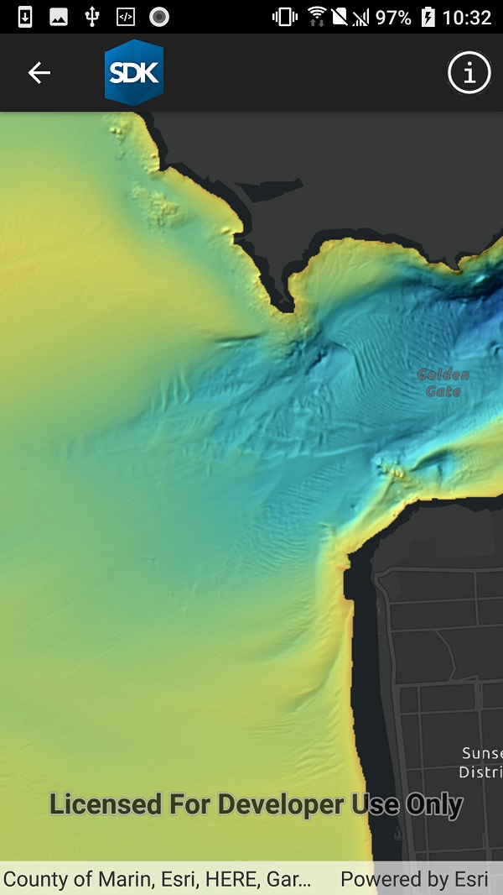

# Raster layer (service)

Create a raster layer from a raster image service.

## Use case

Accessing a raster image from an online service can be useful for analyzing the most up-to-date data available for an area. For example, retrieving recent results of bathymetry surveys within a shipping channel monitored for its sediment build-up would allow planners to assess dredging needs.

## How to use the sample

Simply launch the sample to see a raster from an image service being used on a map.

## How it works

1. Create an `ImageServiceRaster` using the service's URL.
2. Create a `RasterLayer` from the image service raster.
3. Add the raster layer the the map.

## Relevant API

* ImageServiceRaster
* RasterLayer

## About the data

This sample uses a [NOAA raster image service](https://gis.ngdc.noaa.gov/arcgis/rest/services/bag_hillshades_subsets/ImageServer). The service computes a hillshade image from the depth (in meters) of U.S. coastal waters.

## Tags

image service, raster
