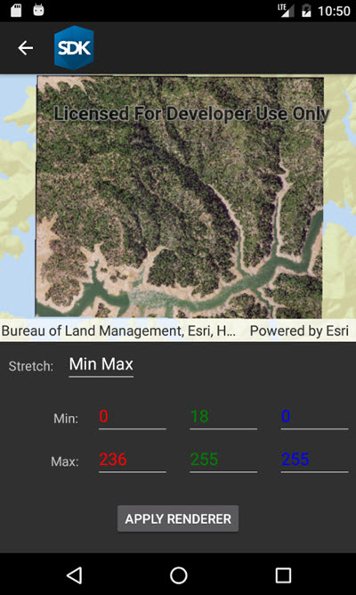

# RGB renderer

Apply an RGB renderer to a raster layer to enhance feature visibility.

## Use case

An RGB renderer is used to adjust the color bands of a multispectral image. Remote sensing images acquired from satellites often contain values representing the reflection of multiple spectrums of light. Changing the RGB renderer of such rasters can be used to differentiate and highlight particular features that reflect light differently, such as different vegetation types, or turbidity in water.

## How to use the sample

Choose one of the stretch parameter types. The other options will adjust based on the chosen type. Add your inputs and select the 'Update' button to update the renderer.

## How it works

1. Create a `Raster` from a from a multispectral raster file.
2. Create a `RasterLayer` from the raster.
3. Create a `Basemap` from the raster layer and set it to the map.
4. Create an `RGBRenderer`, specifying the `StretchParameters` and other properties.
5. Apply the renderer to the raster layer.

## Relevant API

* Basemap
* Raster
* RasterLayer
* RGBRenderer
* StretchParameters

## Offline data

This sample downloads the following items from ArcGIS Online automatically:

* [raster-file.zip](https://www.arcgis.com/home/item.html?id=7c4c679ab06a4df19dc497f577f111bd) - Tif raster file

## About the data

The raster used in this sample shows an area in the south of the Shasta-Trinity National Forest, California.

## Tags

analysis, color, composite, imagery, multiband, multispectral, pan-sharpen, photograph, raster, spectrum, stretch, visualization