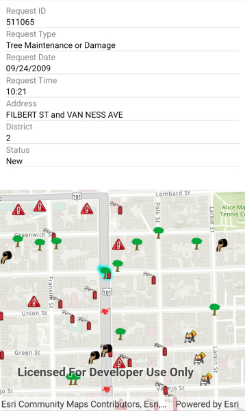

# Show popup

Show predefined popups from a web map.

## Use case

Many web maps contain predefined popups which are used to display the attributes associated with each feature layer in the map, such as hiking trails, land values, or unemployment rates. You can display text, attachments, images, charts, and web links. Rather than creating new popups to display information, you can easily access and display the predefined popups. The popup viewer control from the ArcGIS Toolkit currently supports label/value displays and plaintext HTML descriptions.

## How to use the sample

Tap on the features to prompt a popup that displays information about the feature.

## How it works

1. Create and load a `Map` using a URL.
2. Use a 'GeoViewTapped' event for when the user clicks on the map.
3. Use the `IdentifyLayerAsync` method to identify the top-most feature. 
4. Create a `PopupManager` using the `Popup` from the `IdentifyLayerResult`.
5. Use the `PopupManager` to populate the `PopupViewer` UI element.

## Relevant API

* IdentifyLayerResult
* Popup
* PopupManager

## About the data

This sample uses a [feature layer](https://sampleserver6.arcgisonline.com/arcgis/rest/services/SF311/FeatureServer/0) that displays reported incidents in San Francisco.

## Additional information

This sample uses the `PopupViewer` UI control from the open source [ArcGIS Runtime SDK for .NET Toolkit](https://github.com/Esri/arcgis-toolkit-dotnet).

## Tags

feature, feature layer, popup, toolkit, web map