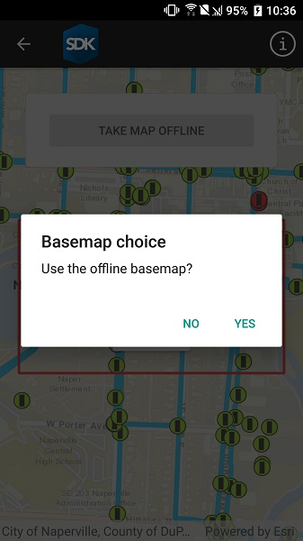

# Generate offline map with local basemap

Use the `OfflineMapTask` to take a web map offline, but instead of downloading an online basemap, use one which is already on the device.

## Use case

Reasons to use a basemap which is already on the device, rather than downloading:

* You want to limit the total download size.
* You want to be able to share a single set of basemap files between many offline maps.
* You want to use a custom basemap (for example authored in ArcGIS Pro) which is not available online.
* You do not wish to sign into ArcGIS.com in order to download Esri basemaps.

The author of a web map can support the use of basemaps which are already on a device by configuring the web map to specify the name of a suitable basemap file. This could be a basemap which:

* Has been authored in ArcGIS Pro to make use of your organizations custom data.
* Is available as a PortalItem which can be downloaded once and re-used many times.

## How to use the sample

1. Use the button to start taking the map offline.
2. Specify whether to download the basemap or use a basemap already taken offline.
3. If you choose to download the online basemap, the offline map will be generated with the same (topographic) basemap as the online web map.
4. To download the Esri basemap, you may be prompted to sign in to ArcGIS.com.
5. If you choose to use the basemap from the device, the offline map will be generated with the local imagery basemap. The download will be quicker since no tiles are exported or downloaded.
6. Since the application is not exporting online ArcGIS Online basemaps you will not need to log-in.

## How it works

The sample creates a `PortalItem` object using a web map's ID. This portal item is used to initialize an `OfflineMapTask` object. When the button is clicked, the sample requests the default parameters for the task, with the selected extent, by calling `OfflineMapTask.CreateDefaultGenerateOfflineMapParameters`.

Once the parameters are created, the application checks the `GenerateOfflineMapParameters.ReferenceBasemapFilename` property. The author of an online web map can configure this setting to indicate the name of a suitable basemap. In this example, the application checks the local file-system for the suggested "naperville_imagery.tpkx".

If the user chooses to use the basemap on the device, the `GenerateOfflineMapParameters.ReferenceBasemapDirectory` is set to the absolute path of the directory which contains the .tpkx file.

A `GenerateOfflineMapJob` is created by calling `OfflineMapTask.GenerateOfflineMap` passing the parameters and the download location for the offline map.

When the `GenerateOfflineMapJob` is started it will check whether `GenerateOfflineMapParameters.ReferenceBasemapDirectory` has been set. If this property is set, no online basemap will be downloaded and instead, the mobile map will be created with a reference to the .tpkx on the device.

## Relevant API

* GenerateOfflineMapJob
* GenerateOfflineMapParameters
* GenerateOfflineMapResult
* OfflineMapTask

## Offline data

This sample uses [naperville_imagery.tpkx](https://arcgis.com/home/item.html?id=85282f2aaa2844d8935cdb8722e22a93). It is downloaded from ArcGIS Online automatically before the sample runs.

## Tags

basemap, download, local, offline, save, web map
