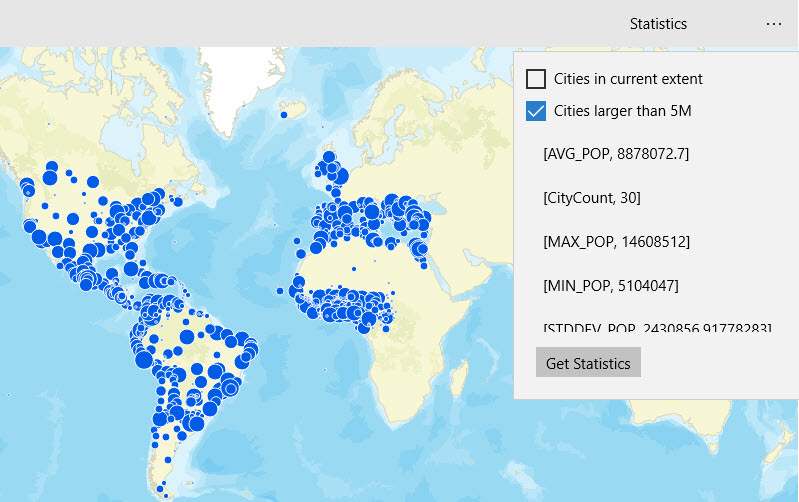

#Statistical query

This sample demonstrates how to query a feature table to get statistics for a specified field.

### Instructions

Check the appropriate boxes to evaluate only features representing the largest cities and/or those within the current extent. Click the button to see basic statistics displayed for world cities.

