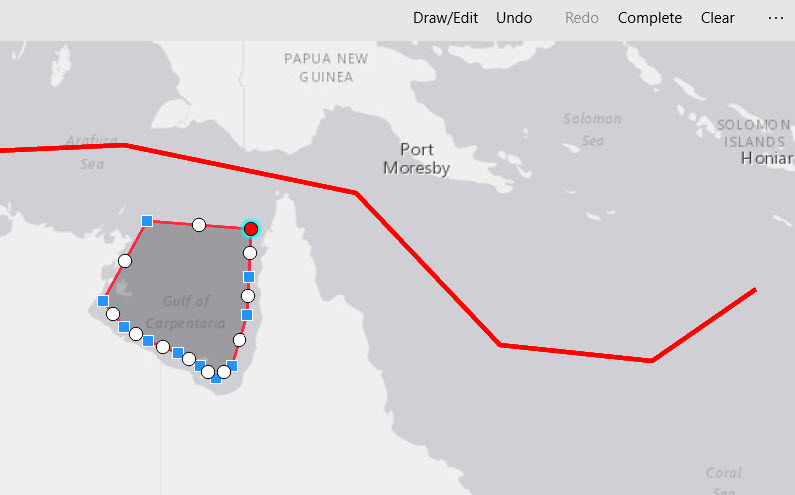

#Sketch graphics on the map

This sample demonstrates how to interactively sketch and edit graphics in the map view and display them in a graphics overlay. You can sketch a variety of geometry types and undo or redo operations.

### Instructions
1. Click the 'Draw/Edit' button.
1. Choose a sketch type from the drop down list.
2. Click the 'Draw' button and click in the map view to create the sketch.
3. While sketching, you can undo/redo operations.
4. Click 'Complete' to finish the sketch.
5. To edit a graphic, click 'Draw/Edit', then 'Edit'. Select a graphic in the map to start editing.
6. Make edits then click 'Complete' to finish editing.

