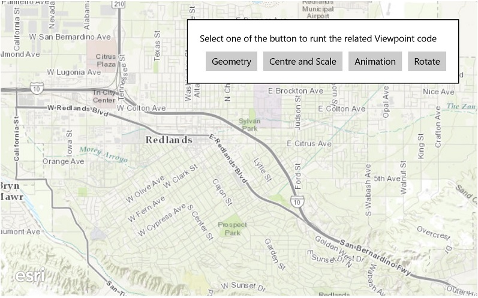

#Change viewpoint

This sample demonstrates how the current viewpoint can be changed. This Sample opens with a default service viewpoint. Each subsequent button click will change the viewpoint using different methods (one to a provided extent, another a point and scale, and another to rotate the viewpoint by 90 degrees.

### Instructions

Click any of the available buttons to change the current viewpoint

