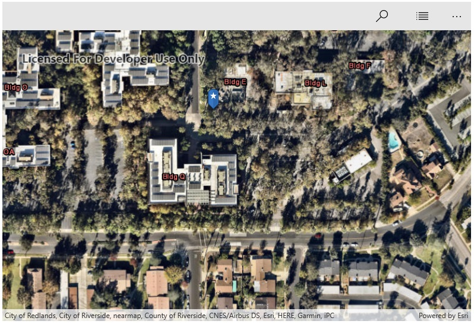

# Find Address

This sample demonstrates how you can use a LocatorTask to geocode an address. The app allows you to see geocode results as you type. Tap the button to see suggestions for possible addresses. Once a marker is on the map, you can tap it to see its address. 

