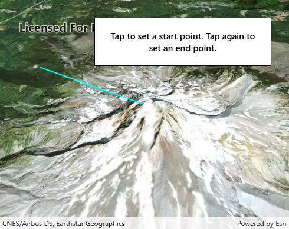

# Line of sight (location)

Perform a line of sight analysis between two points in real time.

## Use case

A line of sight analysis can be used to assess whether a view is obstructed between an observer and a target. Obstructing features could either be natural, like topography, or man-made, like buildings. Consider an events planning company wanting to commemorate a national event by lighting sequential beacons across hill summits or roof tops. To guarantee a successful event, ensuring an unobstructed line of sight between neighboring beacons would allow each beacon to be activated as intended.

## How to use the sample

The sample loads with a preset observer and target location, linked by a colored line. A red segment on the line means the view between observer and target is obstructed, whereas green means the view is unobstructed. 

Click to turn on the mouse move event listener, then move the mouse to update the target location in real time. Click again to lock the target location.

## How it works

1. Create an `AnalysisOverlay` and add it to the scene view.
2. Create a `LocationLineOfSight` with initial observer and target locations and add it to the analysis overlay.
3. Make an `EventHandler<MouseEvent>` to capture mouse movement. Turn the screen point into a scene point with `sceneView.screenToLocationAsync(screenPoint)`.
4. Update the target location with `lineOfSight.TargetLocation = scenePoint`.

## Relevant API

* AnalysisOverlay
* LocationLineOfSight
* SceneView

## Tags

3D, line of sight, visibility analysis
