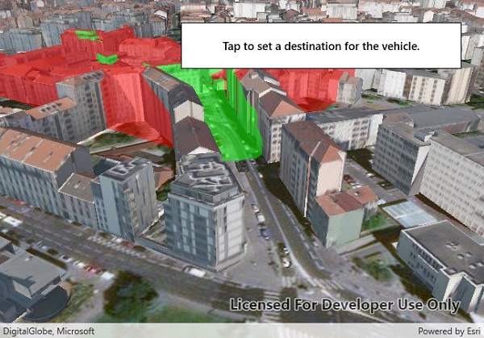

# Viewshed (GeoElement)

This sample demonstrates how to display a live viewshed analysis for a moving GeoElement. The analysis is offset vertically so that the viewpoint is from the top of the GeoElement (in this case, a model of a tank).

## Instructions

Tap on the scene to see the tank move to that point.
