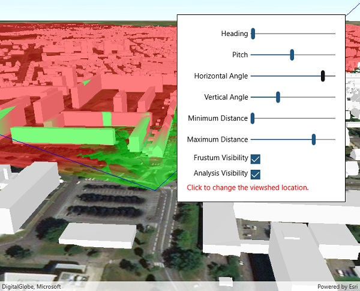

# Viewshed (Location)

This sample demonstrates the configurable properties of viewshed analysis, including frustum color, heading, pitch, distances, angles, and location.

## Instructions

Click anywhere in the scene to change the viewshed observer location.
