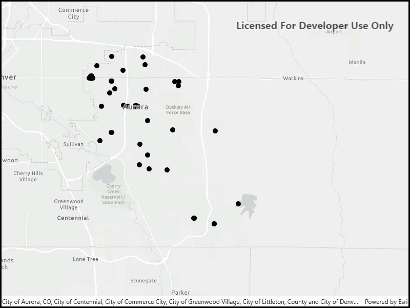

# Feature layer (GeoPackage)

Display features from a local GeoPackage.

## Use case

Useful for applications which consume data maintained by a local source on
the device running the application.

## How it works

1. Create a `GeoPackage` passing the URI string into the constructor.
2. Load the `GeoPackage` with `GeoPackage.loadAsync`
3. When it's done loading, get the `GeoPackageFeatureTable` objects from the geopackage with `geoPackage.getGeoPackageFeatureTables()`
4. Create a `FeatureLayer(featureTable)` for each feature table and add it to the map as an operational layer. Add each to the map as an operational layer with `map.OperationalLayers.Add(featureLayer)`.

## Relevant API

* Map
* FeatureLayer
* GeoPackage
* GeoPackageFeatureTable

## Offline data

This sample downloads the following items from ArcGIS Online automatically:

* [AuroraCO.zip](https://www.arcgis.com/home/item.html?id=68ec42517cdd439e81b036210483e8e7) - GeoPackage with datasets that cover Aurora Colorado: Public art (points), Bike trails (lines), and Subdivisions (polygons), Airport noise (raster), Buildings (raster).

## Tags

GeoPackageFeatureTables, OGC, gpkg, package, standards
