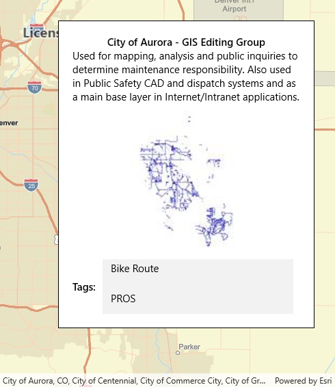

# Read shapefile metadata

This sample demonstrates how to open a shapefile stored on the device, read metadata that describes the dataset, and display it as a feature layer with default symbology.

## Instructions

The shapefile will be downloaded from an ArcGIS Online portal automatically.
