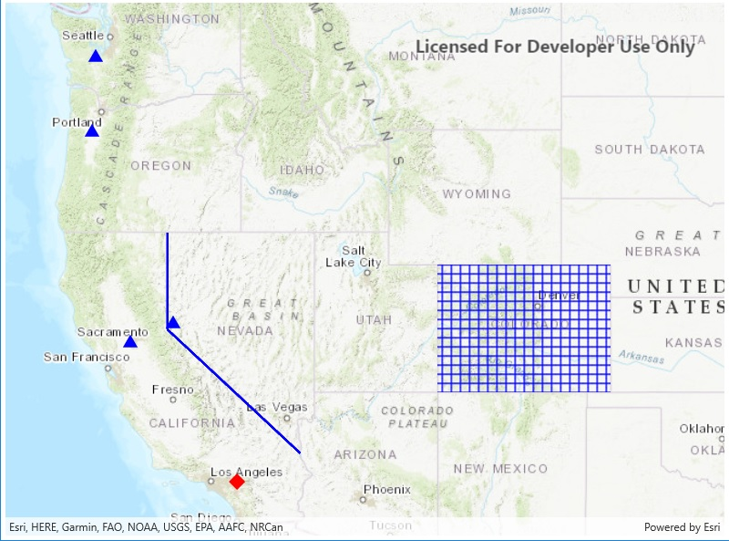

# Create geometries

Create simple geometry types.

## How it works

1. Use the constructors for the various simple `Geometry` types including `Point`, `Polyline`, `Multipoint`, `Polygon`, and `Envelope`.
2. To display the geometry, create a `Graphic` passing in the geometry, and a `Symbol` appropriate for the geometry type.
3. Add the graphic to a graphics overlay and add the overlay to a map view.

## Relevant API

* Envelope
* Multipoint
* Point
* PointCollection
* Polygon
* Polyline

## Additional information

A geometry made of multiple points usually takes a `PointCollection` as an argument or is created through a builder.

## Tags

Geometry, Graphic
