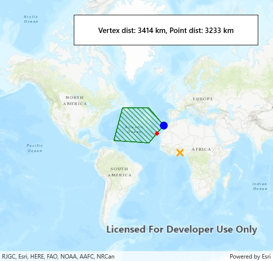

# Nearest vertex

Shows how to find the nearest vertex on a geometry to a given point.

## How to use the sample

Tap anywhere on the map. An orange marker will show the tapped location. A blue marker will show the polygon's nearest vertex to the tapped location. A red marker will show the nearest coordinate on the geometry.

## How it works

1. Get a `Point` to check the nearest vertex against.
2. Call `GeometryEngine.NearestVertex(inputGeometry, point)`. The returned `ProximityResult` can be used to get the coordinate and distance between the vertex and point.
3. Call `GeometryEngine.NearestCoordinate(inputGeometry, point)`. The returned `ProximityResult` can be used to get the coordinate and distance between the coordinate and point.

## Relevant API

* GeometryEngine
* ProximityResult

## Tags

Analysis, Geometry
