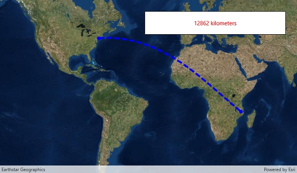

# Geodesic operations

This sample demonstrates how to use the Geometry engine to calculate a geodesic path between two points and measure its distance.

## Instructions

Tap on the map to set the end point of a path from New York City. The geodesic path and geodesic distance will be displayed.
