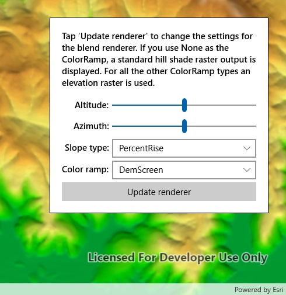

# Blend renderer

This sample demonstrates how to use blend renderer on a raster layer. You can get a hillshade blended with either a colored raster or color ramp.

## Instructions

Tap on the 'Update Renderer' button to change the settings for the blend renderer. The sample allows you to change the Altitude, Azimuth, SlopeType and ColorRamp. If you use None as the ColorRamp, a standard hill shade raster output is displayed. For all the other ColorRamp types an elevation raster is used.
