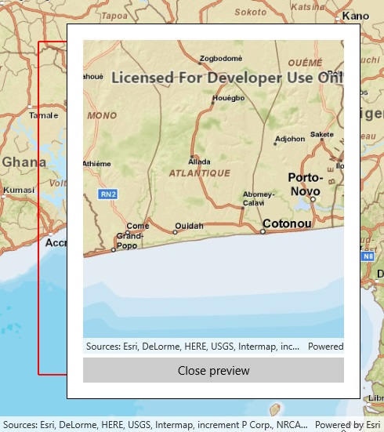

# Export tiles

This sample demonstrates how to export tiles from a map server.

## Instructions

1. Pan and zoom until the area you want tiles for is within the red box.
2. Click 'Export Tiles'.
3. Pan and zoom to see the area covered by the downloaded tiles in the preview box.
