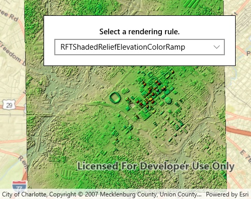

# Raster rendering rule

This sample demonstrates how to create an `ImageServiceRaster`, fetch the `RenderingRule`s from the service info, and use a `RenderingRule` to create an `ImageServiceRaster` and add it to a raster layer.

