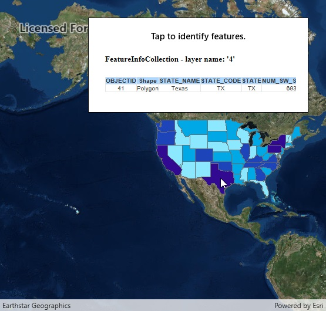

# Identify WMS features

This sample demonstrates how to identify WMS features and display the associated content for an identified WMS feature.

## Instructions

Tap or click on a feature. A callout appears with the returned content for the WMS feature. Note that due to the nature of the WMS service implementation, an empty callout is shown when there is no result; an application might inspect the HTML to determine if the HTML actually contains a feature.
