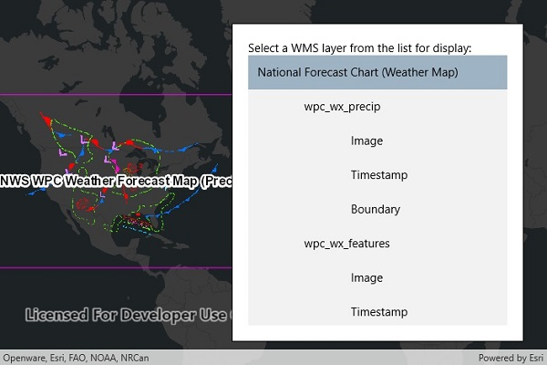

# WMS service catalog

This sample demonstrates how to connect to a WMS service and list available layers and sublayers. Layers are shown in a hierarchy. Selecting a group layer will recursively select all sublayers for display. 

## How to use the sample
- Open the sample. A hierarchical list of layers and sublayers will appear. 
- Select a layer to enable it for display. If the layer has any children, the children will also be selected.

## How it works
1. A `WmsService` is created and loaded.
2. A `WmsService` has a `ServiceInfo` property, which is a `WmsServiceInfo`
3. `WmsServiceInfo` has a `WmsLayerInfo` for each layer (excluding sublayers) in the `LayerInfos` collection
4. A method is called to recursively discover sublayers for each layer. Layers are wrapped in a view model and added to a list.
  * The view model has a `Select` method which recursively selects or deselects itself and sublayers.
  * The view model tracks the children and parent of each layer.

## Relevant API
 - WmsService
 - WmsServiceInfo
 - WmsLayerInfo
 - WmsLayer(List<WmsLayerInfo>)

## Tags
WMS, services, browsing, catalog