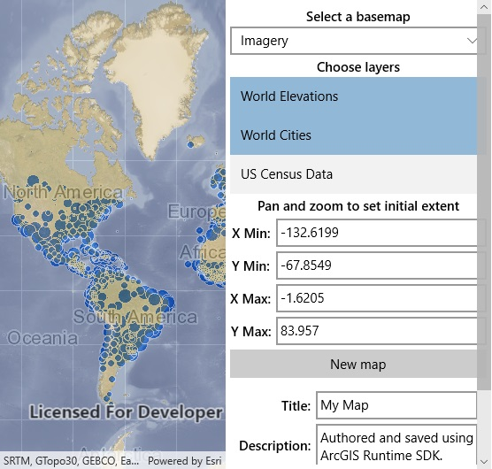

# Create and save map

Create and save a map as an ArcGIS `PortalItem` (i.e. web map).

## Use case

Maps can be created programmatically in code and then serialized and saved as an ArcGIS `web map`. A `web map` can be shared with others and opened in various applications and APIs throughout the platform, such as ArcGIS Pro, ArcGIS Online, the JavaScript API, Collector, and Explorer.

## How to use the sample

1. Select the basemap and layers you'd like to add to your map.
2. Press the Save button.
3. Sign into an ArcGIS Online account.
4. Provide a title, tags, and description.
5. Save the map.

## How it works

1. A `Map` is created with a `Basemap` and a few operational layers.
2. A `Portal` object is created and loaded. This will issue an authentication challenge, prompting the user to provide credentials.
3. Once the user is authenticated, `map.SaveAsAsync` is called and a new `Map` is saved with the specified title, tags, and folder.

## Relevant API

* AuthenticationManager
* ChallengeHandler
* GenerateCredentialAsync
* IOAuthAuthorizeHandler
* Map
* Map.SaveAsAsync
* Portal

## Tags

ArcGIS Online, OAuth, portal, publish, share, web map