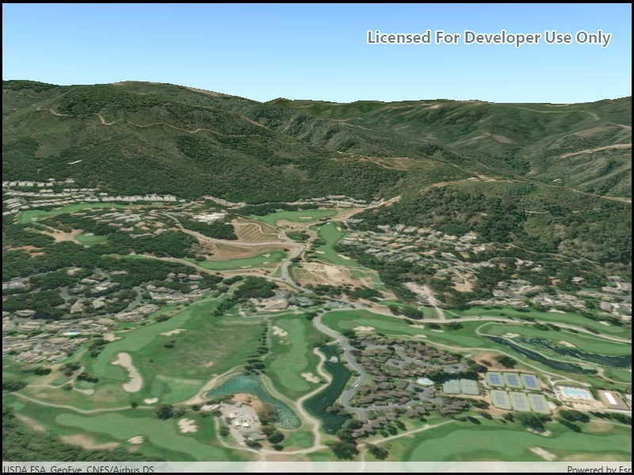

# Create terrain surface from a tile package

Set the terrain surface with elevation described by a local tile package.

## How it works

1. Create a `Scene` and add it to a `SceneView`.
2. Create an `ArcGISTiledElevationSource` with the path to the local tile package.
3. Add this source to the scene's base surface: `Scene.BaseSurface.ElevationSources.Add(tiledElevationSource)`.

## Relevant API

* ArcGISTiledElevationSource
* Surface

## Additional information

The tile package must be a LERC (limited error raster compression) encoded TPK. Details on creating these are in the [ArcGIS Pro documentation](https://pro.arcgis.com/en/pro-app/help/sharing/overview/tile-package.htm).

The terrain surface is what the basemap, operational layers, and graphics are draped on.

## Tags

3D, Tile Cache, Elevation, Surface
