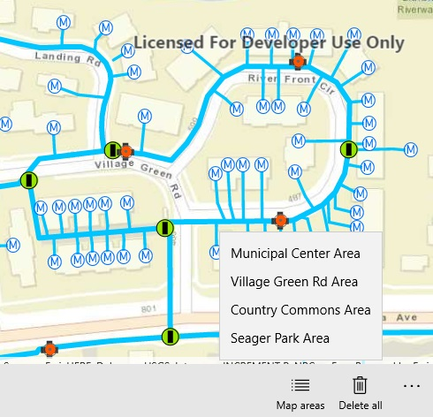

# Download preplanned map areas

This sample demonstrates how to download preplanned map areas from a webmap. In the preplanned offline workflow, the author of the online map defines map areas for offline use. When these areas are created, their offline packages are created and stored online for clients to download. This is the biggest difference between on-demand and preplanned workflows since on-demand workflow data packages are generated at request time.

## Instructions

Select an area from the list to download. When you're done, select 'delete offline areas' to delete the downloaded copy of the map areas. 
