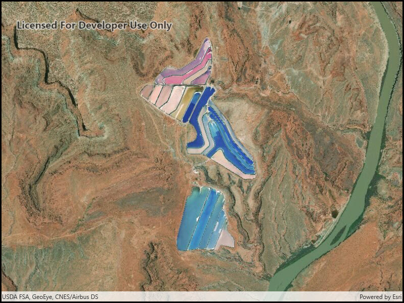

# Set initial map area

This sample displays a map at a specific viewpoint. In this sample a viewpoint is constructed from an envelope defined by minimum (x,y) and maximum (x,y) values. The map's initialViewpoint is set to this viewpoint before the map is loaded. Upon loading the map zooms to this initial area.

