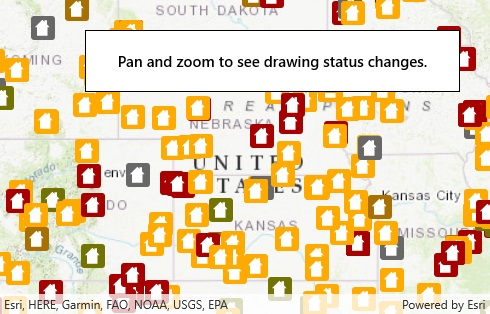

# Display draw status

Get the draw status of your map view or scene view to know when all layers in the map or scene have finished drawing.

## Use case

You may want to display a loading indicator while layers are loading, which could then be removed on `DrawStatus.Completed`.

## How to use the sample

Simply run the app.

## How it works

1. Create a `MapView` and subscribe to the `DrawStatusChanged` event.
2. Inspect the draw status property in the event handler to determine draw status.

## Relevant API

* Map
* DrawStatus
* MapView

## Tags

MapViews, SceneViews and UI
