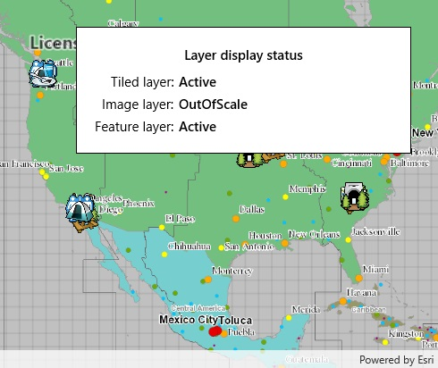

# Display layer view state

Determine if a layer is currently being viewed.

## Use case

The view state includes information on the loading state of layers and whether layers are visible at a given scale. For example, you might change how a layer is displayed in a layer list to communicate whether it is being viewed in the map.

## How to use the sample

Pan and zoom around in the map. Each layer's view status is displayed. Notice that some layers configured with a min and max scale change to "OutOfScale" at certain scales.

## How it works

1. Create an `Map` with some operational layers.
2. Set the map on a `MapView`.
3. Add an event handler for the `LayerViewStateChanged` event in the map view.

## Relevant API

* LayerViewStateChanged
* LayerViewStateChangedEventArgs
* Map
* MapView

## About the data

The map shows a tiled layer of world time zones, a map image layer of the census, and a feature layer of recreation services.

## Tags

layer, map, status, view