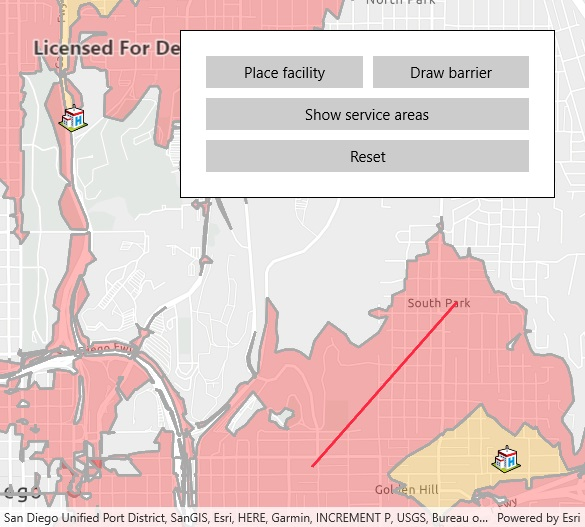

# Find service area (interactive)

Demonstrates how to find services areas around a point using the ServiceAreaTask. A service area shows locations that can be reached from a facility based off a certain impedance [travel time in this case]. Service areas for a two and five minute travel time are used. Barriers can also be added which can effect the service area by not letting traffic through and adding to the time to get to locations.

## Instructions

-To add a facility, click the facility button, then click anywhere on the MapView.
-To add a barrier, click the barrier button, and click multiple locations on MapView.
-Double tap on the MapView to finish drawing the barrier.
-To show service areas around facilities that were added, click the show service areas button.
-Click the reset button to clear all graphics and features.
