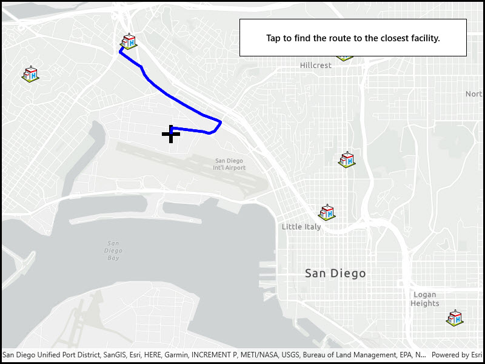

# Find closest facility to an incident (interactive)

Find a route to the closest facility from a location.

## Use case

Quickly and accurately determining the most efficient route between a location and a facility is a frequently encountered task. For example, a paramedic may need to know which hospital in the vicinity offers the possibility of getting an ambulance patient critical medical care in the shortest amount of time. Solving for the closest hospital to the ambulance's location using an impedance of "travel time" would provide this information.

## How to use the sample

Click near any of the hospitals and a route will be displayed from that clicked location to the nearest hospital.

## How it works

1. Create a `ClosestFacilityTask` using a Url from an online network analysis service.
2. Get `ClosestFacilityParameters` from task, `task.CreateDefaultParametersAsync()`
3. Add facilities to parameters, `closestFacilityParameters.Facilities.AddAll(facilities)`.
4. Add the incident to parameters, `closestFacilityParametersIncidents`.
5. Get `ClosestFacilityResult` from solving task with parameters, `task.SolveClosestFacilityAsync(facilityParameters)`
6. Get index list of closet facilities to incident, `facilityResult.RankedFacilities[0]`
7. Get index of closest facility, `rankedFacilitiesList[0]`
8. Find closest facility route, `facilityResult.Route(closestFacilityIndex, IncidentIndex)`
9. Display route to `MapView`:
    * Create `Graphic` from route geometry, `new Graphic(route.RouteGeometry)`
    * Add graphic to `GraphicsOverlay` which is attached to the mapview

## Relevant API

* ClosestFacilityParameters
* ClosestFacilityResult
* ClosestFacilityRoute
* ClosestFacilityTask
* Facility
* Graphic
* GraphicsOverlay
* Incident
* MapView

## Tags

incident, network analysis, route, search