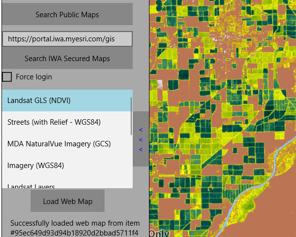

# Integrated windows authentication

Use Windows credentials to access services hosted on a portal secured with Integrated Windows Authentication (IWA).

## How to use the sample

1. Enter the URL to your IWA-secured portal.
2. Click the button to search for web maps stored on the portal.
3. You will be prompted for a user name, password, and domain (some platforms will use the current Windows login).
4. If you authenticate successfully, portal item results will display in the list.
5. Select a web map item to display it in the map view.

## How it works

1. The `AuthenticationManager` object is configured with a challenge handler that will prompt for a Windows login (username, password, and domain) if a secure resource is encountered.
2. When a search for portal items is performed against an IWA-secured portal, the challenge handler creates an `ArcGISNetworkCredential` object from the information entered by the user.
3. If the user authenticates, the search returns a list of web maps (`ArcGISPortalItem`) and the user can select one to display as a `Map`.
4. On some platforms, the current Windows account is used by default and a login prompt will not be shown if it can authenticate successfully.

## Relevant API

* AuthenticationManager
* ArcGISPortal
* ArcGISNetworkCredential

## About the data

This sample searches for web map portal items on a secure portal. To successfully run the sample, you need:

* Access to a portal secured with Integrated Windows Authentication that contains one or more web map items.
* A login that grants you access to the portal.

## Additional information

IWA, which is built into Microsoft Internet Information Server (IIS), works well for intranet applications but isn't always practical for internet apps.

More information about IWA and it's use with ArcGIS can be found at the following links:

* [IWA - Wikipedia](https://en.wikipedia.org/wiki/Integrated_Windows_Authentication)
* [Use Integrated Windows Authentication with your portal](http://enterprise.arcgis.com/en/portal/latest/administer/windows/use-integrated-windows-authentication-with-your-portal.htm)

## Tags

Authentication, Security, Windows, Portal
