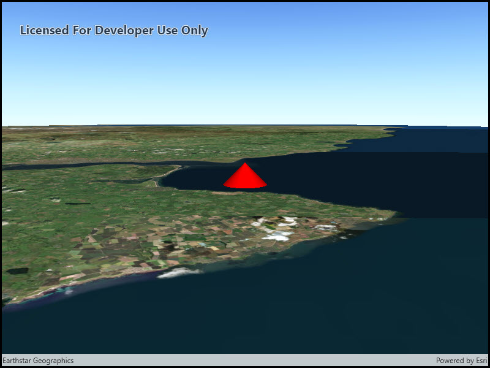

# Distance composite symbol

This sample demonstrates how to create a `DistanceCompositeSceneSymbol` with unique marker symbols to display at various distances from the camera.

## Instructions

1. When the Scene initially loads, you will be looking at a point graphic symbolized with a 3D cone symbol.
2. Zoom slightly closer to the graphic and the symbol will change to a blue 3D cube symbol.
3. Zoom farther from the graphic and the symbol will change back to a 3D cone and then to a simple marker symbol.
