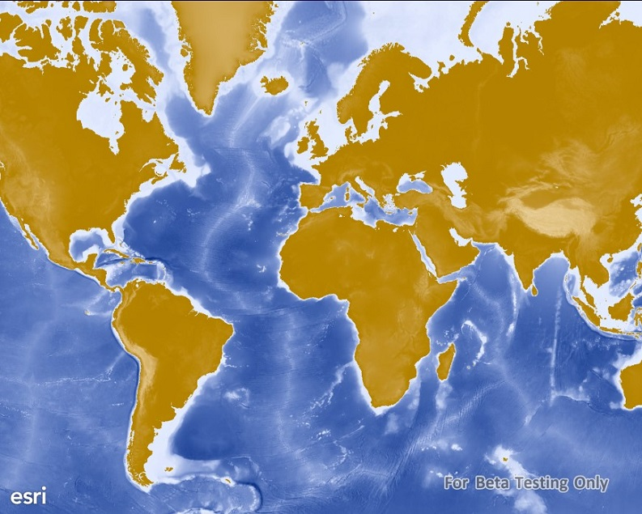

#ArcGIS map image layer (URL)

This sample demonstrates how to add an ArcGISMapImageLayer as a base layer in a map. The ArcGISMapImageLayer comes from an ArcGIS Server sample web service.

### Instructions

