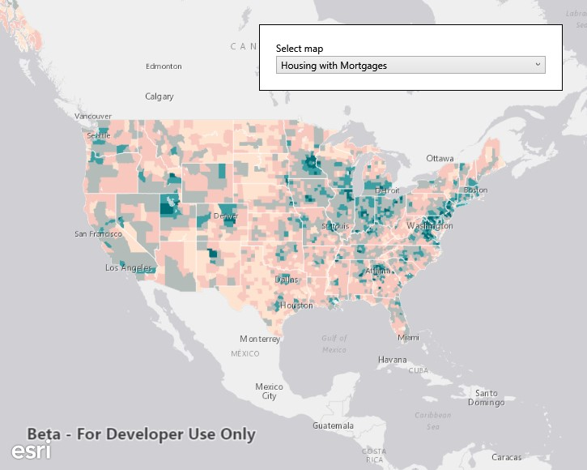

#Open an existing map

This sample demonstrates how to open an existing map from a portal. The sample opens with a map displayed by default. You can change the shown map by selecting a new one from the populated list.

### Instructions

Click on the dropdown to select one of the possible Portal Maps. Select a map item and then click 'Load Map' the corresponding Map item will then be loaded into view.

