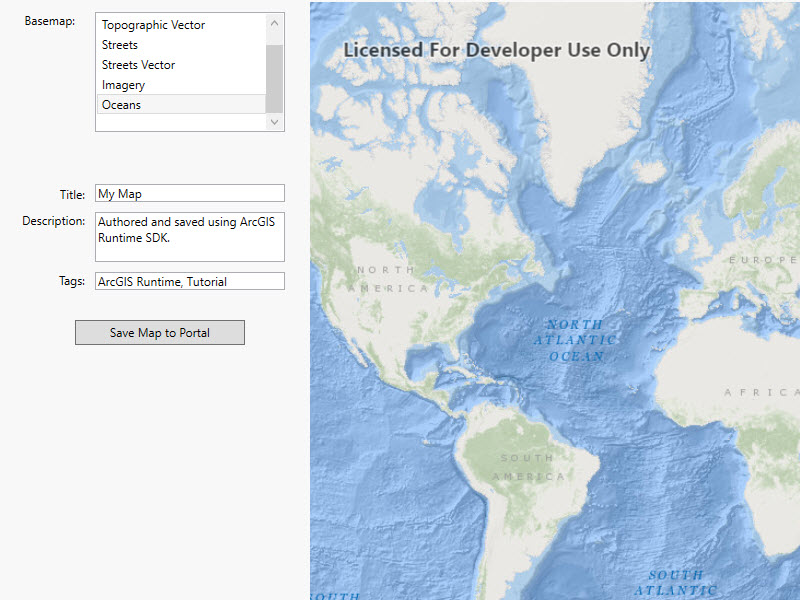

# Author, edit, and save a map

This sample demonstrates how to author and save a map as an ArcGIS portal item (web map). It is also the solution to the [Author, edit, and save maps to your portal tutorial](https://developers.arcgis.com/net/latest/wpf/guide/author-edit-and-save-maps-to-your-portal.htm). Saving a map to arcgis.com requires an ArcGIS Online login.

### Instructions

1. Pan and zoom to the extent you would like for your map.
2. Choose a basemap from the list of available basemaps.
3. Click 'Save ...' and provide info for the new portal item (Title, Description, and Tags).
4. Click 'Save Map to Portal'.
5. After successfully logging in to your ArcGIS Online account, the map will be saved to your default folder.
6. You can make additional changes, update the map, and then re-save to store changes in the portal item.